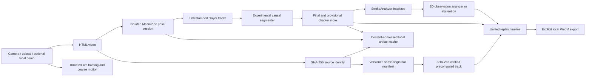

# Product, architecture, and decision log

## Cross-functional convergence

The target user is an adult beginner-to-intermediate player reviewing fixed-camera practice between lessons. Product wanted immediate useful feedback; the coach wanted stroke-specific language; sports science and research rejected monocular-pose claims about actual contact, timing, force, loading, racket face, or ball outcome; engineering required deterministic local execution; QA required visible abstention; the CEO required a credible demonstration without paid services.

The resolved MVP is therefore a **video evidence reviewer**, not an automated certified coach. It provides neutral live framing, automatic post-session movement chapters, pose overlays, descriptive 2D observations, explicit uncertainty, and optional coach-reviewed rubrics later. Unverified clips receive no authoritative drill. Unsupported evidence stays visible and reviewable rather than being discarded.

## Current public POC journey

1. Upload one local MP4, MOV, or WebM clip up to 30 seconds and 200 MB.
2. Create a temporary object URL immediately so the real source video remains visible and playable independently of analysis.
3. Hash the source locally, reuse an exact compatible derived pose artifact when available, or load MediaPipe Pose Landmarker Lite and sample the decoded video at up to 6 Hz with a 180-frame cap. The analyzer permits conservative image-plane observations at 6 Hz but withholds speed magnitude below 30 Hz.
4. Automatically choose a player only when the tracker produces a recommendation. When multiple tracks are a near-tie, publish no observations until the user explicitly chooses Player A/B from settings; the result records `selectionMethod: manual`.
5. Run the experimental movement segmenter and descriptive pose analyzer. Automatic stroke identity is disabled in this upload flow; low-rate, provisional, or weak evidence abstains.
6. Review the source video with a timestamp-synchronized pose overlay and evidence-linked observation cards. Any analysis failure leaves normal source playback available.
7. Independently resolve the full source SHA-256 against
   `precomputed-ball-tracks.v1`. Exact known bytes may receive a verified
   observed-only ball overlay; unknown, unavailable, mismatched, or invalid
   entries remain pose-only.

## Architecture

Key files:

- `src\analysis\poseExtractor.ts` — local MediaPipe adapter, pinned runtime/model manifest, SHA-256 verification of the same-origin model artifact, GPU/CPU fallback, monotonic timestamps, separate live/offline graph lifecycles, ordered sampling up to 6 Hz and 180 samples, progressive batches, yielding, abort-aware seeking, and cancellation-safe initialization/cleanup.
- `src\analysis\videoAnalysisPipeline.ts` — source hashing, compatible pose-cache reuse, progressive extraction, automatic player selection, movement segmentation, conservative analysis, progress, and stale-run cancellation boundary.
- `src\analysis\playerTracker.ts` — short-lived A/B tracks and transparent larger/lower persistent-track recommendation.
- `src\analysis\strokeSegmenter.ts` — temporary causal change-point baseline. It never scans future samples while an event is active. Finalization requires pre/post context, valid samples around the peak, pose/scale evidence, duration bounds, and effective sampling. Failed finalization produces provisional ranges instead of blocking playback.
- `src\analysis\heuristicAnalyzer.ts` — image-plane observations and explicit abstention. Provisional ranges return no descriptors or coaching.
- `src\analysis\types.ts` — replaceable analyzer boundary and revisioned `VideoAnalysisRun`.
- `src\analysis\providerRegistry.ts` — metadata-only stage-provider catalog and fail-closed product eligibility gate; production has no executable ball binding.
- `src\analysis\analysisCache.ts` — recursive canonical hashing, immutable stage envelopes, memory-fronted IndexedDB persistence, semantic read validation, corruption eviction, atomic publication, and clear-cache support.
- `src\analysis\precomputedBallTrack.ts` — strict
  `precomputed-ball-tracks.v1` / `precomputed-ball-track.v1` parsing, stable
  manifest plus versioned fallback, exact source hash/bytes/duration/geometry
  matching, lazy track fetch, declared byte length and SHA-256 verification,
  abort handling, and independently revisioned in-memory reuse.
- `src\analysis\ballOverlayModel.ts` — nearest bounded source-frame selection,
  visualization-only marker radius, and raw observed-only trail/reset rules.
- `src\components\BallOverlay.tsx` — DPR-aware intrinsic-source-pixel rendering
  using the same contain geometry and presented-frame clock as `PoseViewer`.
- `src\components\AnnotatedReplay.tsx` — full-source replay, skeleton/labels, unified chapter lane, key markers, navigation hooks, manual marker actions, and WebM export.

## Measurement contract

| Output | Raw evidence | Formula | Gate / limitation |
|---|---|---|---|
| Shoulder-line orientation change | shoulder landmarks 11/12 | projected line angle change modulo 180° | 2D only; withheld on provisional/unstable input |
| Hand-to-torso separation | selected wrist and shoulder midpoint | distance / median shoulder width | not a racket/contact measure; serve rubric not applied |
| Pelvis projection | hips 23/24 and ankles 27/28 | mid-pelvis x within visible ankle span | not center of mass or weight transfer |
| Post-peak hand path | selected wrist | peak-to-offset displacement / shoulder width | boundary dependent; implausible values withheld |
| Possible movement peak | timestamped wrist landmarks | largest available local 2D displacement rate | not ball contact; magnitude withheld below 30 Hz |

Diagnostics record actual timestamps, median interval, interval IQR, maximum gap, effective rate, pose coverage, scale stability, event prominence, and boundary uncertainty. Gaps invalidate local derivatives. Sampling below scientific descriptor gates can still create a visible review marker but cannot create authoritative technique output.

## Decision log

| Decision | Accepted reasoning | Revisit trigger |
|---|---|---|
| Browser-local React/TypeScript/Vite | No credentials/backend; easy camera, canvas, tests, and local privacy. | Accounts, shared progress, or server inference becomes a validated requirement. |
| MediaPipe Pose Landmarker Lite float16/v1 with Tasks Vision 1.0.1 | Apache-2.0 browser runtime, official Google artifact copied to a versioned same-origin path and verified as SHA-256 `59929e…d574a`, useful 33-landmark coverage, GPU/CPU fallback, and about 5.8 MB model size. The release includes the exact Apache-2.0 license text and a MediaPipe attribution/upstream-NOTICE audit in `public\models`. Public documentation does not disclose a complete training-data inventory; it is general-purpose and not tennis-validated. | A rights-cleared challenger demonstrates measured tennis-domain accuracy/latency benefit with equivalent privacy, integrity, and fallback. |
| No scores, confidence percentages, or contact timing | Current evidence is not calibrated to correctness and lacks ball/racket truth. | Coach-labelled held-out validation proves a declared rubric. |
| Automatic full-video chapters | Review resembles sports-video chapters and avoids a candidate-selection gate. | Validated temporal model changes chapter semantics. |
| A provisional review path survives strict gates | When no chapter finalizes, segmentation uncertainty must not remove source playback or useful estimates. | Extend the validated temporal model to preserve mixed final/provisional candidates. |
| Rule segmenter is Experimental | It is a transparent temporary baseline, not learned AI segmentation. | Retire after a licensed temporal model wins held-out boundary/class accuracy, latency, size, and browser fallback gates. |
| Two-player one-time confirmation | Track recommendation is useful but not physical identity proof. | Validated identity/target selection exists. |
| Explicit WebM export only | Keeps video local and avoids FFmpeg/backend requirements. | Reliable local MP4/audio support is measured and requested. |
| Replaceable precomputed-ball evidence provider | A full upload SHA-256 may select only a versioned same-origin artifact whose source bytes/timeline/geometry and artifact digest validate. Ball provider/cache identity stays separate from pose. This permits a bounded known-video demo without enabling executable or filename-selected inference. | A reviewed live provider and artifact pass rights, benchmark, researcher, PM, QA, and CEO gates. |
| Content-addressed stage cache | Exact source bytes plus stage/provider/model/checkpoint/config/contract/decoder identity and direct dependency artifact hashes allow selective reuse without filename assumptions. Pose, chapters, ball observations, trajectory, court, and stroke stages remain independently invalidatable. | Storage pressure or cross-device workflows require a user-approved alternative. |
| Derived artifacts only | Source metadata, pose landmarks, and chapters may persist locally; raw decoded RGB frames, `VideoFrame`, `ImageBitmap`, and object URLs remain ephemeral. | A measured model requires raw-frame persistence and the user explicitly accepts that privacy/storage change. |

## Provider and cache architecture decision

Research challenged a monolithic ball adapter because it conflated runtime availability, rights, research authorization, product enablement, and multiple learned stages. The accepted template defines separate `PlayerEvidenceProvider`, `BallObservationProvider`, `TrajectoryProvider`, and `TemporalEventProvider` interfaces with immutable descriptors. Registry metadata is separate from executable bindings, so a visible template or research state cannot activate inference. Rules may orchestrate, validate, abstain, protect playback, and explain state; they cannot fabricate coordinates, trajectories, contact, or stroke labels.

Cache identity is the SHA-256 of recursively canonical JSON containing the source-video SHA-256, stage and implementation version, provider/model/runtime/checkpoint identity, preprocessing/config hash, output contract, decoder/timeline version, upstream artifact hashes, and direct dependency artifact hashes. Changing a ball provider therefore changes ball-observation and dependent trajectory/event keys while leaving an independent player-pose key unchanged. Observed ball artifacts and inferred trajectory artifacts are distinct stages and cannot be conflated by cache reuse.

Writes are published only after complete payload validation and hashing. IndexedDB commits the temporary and committed records in one transaction; cancellation or cache clearing invalidates late publication and deletes only the exact artifact hash written by that operation. Reads recompute both the payload hash and the complete envelope artifact hash before reuse, then apply the stage semantic validator. Persistent payload validation recursively rejects `Blob`, `File`, `VideoFrame`, `ImageBitmap`, `ImageData`, array/pixel buffers, and `blob:` URLs. Corrupt or stale records are evicted and treated as misses. Storage/quota/cache failures are non-blocking: analysis continues and the recreated source-video playback remains available. Post-session analysis has an explicit cancellation control; cancellation stops extraction/publication but does not revoke or hide the current source video.

## Progressive architecture decision

The accepted next architecture is mode-independent and revisioned: `FrameSource -> ModeScheduler -> FeatureExtractor adapter -> TemporalSegmenter -> IncrementalEventStore -> timeline`. `requestVideoFrameCallback()` is the preferred media clock; inference must not execute inside the callback. Live uses a latest-frame-only bounded queue and separate graph; Post uses ordered bounded work, cancellation, and no silent dropping. WebCodecs and ONNX Runtime Web remain optional adapters, not critical-path dependencies, until they demonstrate a measured benefit and pass model/operator/license/browser review.

The current implementation publishes updated chapter estimates every 12 pose samples and can expose a clean single-player finalized chapter before the complete extraction pass ends. The final pass reconciles all chapters and isolates chapter-level failures. It still uses repeated HTML-video seeks and synchronous MediaPipe calls rather than a worker-backed bounded scheduler, so this is a genuine but partial progressive implementation. Browser-local background processing continues only while the page remains open; tab close or OS suspension can stop it. Durable jobs require a native service or opt-in backend and remain pilot scope.

## Capability program

Capabilities advance sequentially: Phase 0 POC stability, Phase 1 ball tracking, Phase 2 court calibration/player position, then Phase 3 validated stroke classification and chapters. Runtime input remains ordinary monocular RGB video; CSV annotations, sensors, radar, and special cameras are never required. Each capability requires independent model/license research, a developer spike, cross-functional measured evaluation, and defect repair before the next phase.

`src\analysis\ballTracking.ts` defines the reviewed Phase 1 boundary without selecting a model: versioned `BallObservation`, `BallTrack`, metrics, model/license manifest, progress callback, cancellation signal, and an explicit unavailable result. A future browser or local Python/GPU adapter must accept the ordinary video and return this schema. No ball tracker is active in the current product.

### Phase 1A model-selection decision

Independent research concluded **NO ADOPTION**. No reviewed candidate currently combines ordinary monocular RGB inference, runnable tennis weights, complete code/checkpoint/framework/data/source-media rights, held-out rear-view validation, deployment feasibility, and calibrated abstention. Ball tracking therefore remains dark and the adapter is not connected to the UI.

After unconditional Phase 0 sign-off, the only authorized next step is a controlled local/offline Python feasibility bake-off. RacketVision BallTrack is the primary conditional research candidate and WASB tennis is the independent legacy baseline; a rights-clean generic detector may be used only as a negative control. RacketVision checkpoint licensing and source-media rights remain unresolved, while WASB weight and original-footage rights remain unresolved. TrackNetV4 remains watchlist-only because official weight links are not runnable. No checkpoint may be redistributed or become a product dependency until rights and local held-out measurements are resolved.

Learned replacement targets are explicit rather than encoded as product truth:

- Model heatmaps/logits plus held-out calibration replace heuristic confidence.
- A learned temporal linker replaces fixed interpolation and gap rules.
- Learned court context replaces fixed court/color confuser rules.
- An explicit visible/occluded/absent temporal state head replaces coordinate sentinels.
- Tennis event spotting may replace body-motion event proxies, but event spots must not be presented as physical racket-ball contact.
- A causal live and acausal post-session temporal model may replace wrist-speed chapter proposals behind the revisioned segment interface.

The temporary rules are limited to orchestration, evidence eligibility, safety, abstention, explainability, and fixtures. Their retirement trigger is a rights-cleared candidate that improves held-out source-video calibration, continuity, localization/event quality, abstention behavior, latency, and resource use without weakening local privacy or playback fallback. Evaluation acceptance values remain research governance, not runtime inference thresholds.

## Privacy and safety

Video stays local. The exact MediaPipe WASM runtime is fetched from its pinned jsDelivr URL on first use; the model is fetched from a versioned same-origin path and SHA-256 verified before initialization. "Local video processing" therefore does not mean fully offline runtime delivery. The app also fetches a small same-origin precomputed-ball manifest and, only for an exact known source hash, a declared JSON track whose bytes and SHA-256 are verified before use. Neither request contains video bytes. Raw decoded frames are not persisted. Derived source metadata, pose landmarks, and movement chapters may persist in browser IndexedDB under content-addressed keys that include the verified model digest; verified ball JSON uses a separate revisioned in-memory cache. The settings panel exposes a clear action. Object URLs are never cached. No video upload, telemetry, automatic video export, live ball inference, contact detector, tactical inference, or medical/correctness claim exists. Guidance is general 2D movement observation.

## Pose overlay rendering decision

The active upload renderer uses DPR-aware canvases over the intrinsic video aspect ratio. It draws the explicitly selected player's nearest eligible pose frame only, with a bounded timestamp tolerance and no landmark interpolation. Primary pose evidence is cyan; magenta is reserved for an intentionally requested secondary track and is not shown in the default analysis. Landmarks below 0.45 visibility are omitted. Joints are circular four-source-pixel marks and limbs are rounded semi-transparent four-source-pixel strokes, including eligible ankle/heel/toe links. Stale overlays are suppressed.

When verified ball evidence is also available, pose-derived movement segments for
that same selected player become timeline ranges and a clickable list only when
an `observed` ball coordinate falls inside the segment's active onset-to-offset
window. Selecting a range seeks to its onset. This temporal overlap supports
navigation only; it does not identify physical contact or classify the stroke.

For an exact verified known source, a separate canvas selects the canonical
BallTrack frame by source timeline and renders only `observed` coordinates.
`ambiguous` and `abstained` states contain no coordinate and clear the trail.
The marker uses emitted component radius plus 1.5 source pixels, clamped to
3–18 source pixels; when the optional genuine radius is absent, a conservative
6-source-pixel visualization-only radius is used. The trail contains at most 18
raw observed points and 650 ms, fades older segments, and resets on any
non-observed state, seek, replacement, backwards/large timestamp discontinuity,
or a large-distance safeguard. It performs no smoothing, interpolation, repair,
prediction, contact detection, or outcome inference.
