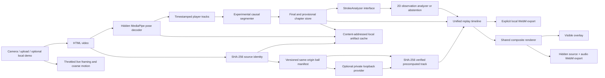

# Product, architecture, and decision log

## Cross-functional convergence

The target user is an adult beginner-to-intermediate player reviewing fixed-camera practice between lessons. Product wanted immediate useful feedback; the coach wanted stroke-specific language; sports science and research rejected monocular-pose claims about actual contact, timing, force, loading, racket face, or ball outcome; engineering required deterministic local execution; QA required visible abstention; the CEO required a credible demonstration without paid services.

The resolved MVP is therefore a **video evidence reviewer**, not an automated certified coach. It provides neutral live framing, automatic post-session movement chapters, pose overlays, descriptive 2D observations, explicit uncertainty, and optional coach-reviewed rubrics later. Unverified clips receive no authoritative drill. Unsupported evidence stays visible and reviewable rather than being discarded.

## Current public POC journey

1. Upload one local MP4, MOV, or WebM clip up to 30 seconds and 200 MB.
2. Create a temporary object URL immediately so the real source video remains visible and playable independently of analysis.
3. Start independent pose and ball jobs as soon as source metadata is available.
   The visible player is never used for inference seeking. Pose uses a hidden
   decoder; ball first resolves the exact source hash against the precomputed
   manifest and may then use an explicitly configured private loopback provider.
4. Reuse an exact compatible derived pose artifact when available, or load MediaPipe Pose Landmarker Lite and sample the hidden decoded video at up to 6 Hz with a 180-frame cap. Publish each pose batch to the viewer while extraction continues. The analyzer permits conservative image-plane observations at 6 Hz but withholds speed magnitude below 30 Hz.
5. Automatically choose one primary player using persistence, visible-body coverage, image area, and court depth. Secondary or stray pose detections remain internal tracking candidates and are never offered as an analysis choice.
6. Run the experimental movement segmenter and descriptive pose analyzer as pose finalization. Automatic stroke identity is disabled in this upload flow; low-rate, provisional, or weak evidence abstains.
7. Review the source video while either stage continues. Any pose or ball failure/cancellation leaves normal source playback and the other stage available.
8. Independently resolve the full source SHA-256 against
   `precomputed-ball-tracks.v1`. Exact known bytes may receive a verified
   observed-only ball overlay; unknown, unavailable, mismatched, or invalid
   entries remain pose-only unless the private local provider is configured.
9. Export enabled ready overlays explicitly to WebM from a separate hidden
   source video. The composite renderer is shared with the onscreen viewer and
   original audio is attached when Chrome/Edge exposes an audio track.

## Architecture

Key files:

- `src\analysis\poseExtractor.ts` — local MediaPipe adapter, pinned runtime/model manifest, SHA-256 verification of the same-origin model artifact, GPU/CPU fallback, monotonic timestamps, separate live/offline graph lifecycles, ordered sampling up to 6 Hz and 180 samples, progressive batches, yielding, abort-aware seeking, and cancellation-safe initialization/cleanup.
- `src\analysis\videoAnalysisPipeline.ts` — source hashing, compatible pose-cache reuse, progressive extraction, automatic player selection, movement segmentation, conservative analysis, progress, and stale-run cancellation boundary.
- `src\analysis\playerTracker.ts` — short-lived A/B tracks and transparent larger/lower persistent-track recommendation.
- `src\analysis\strokeSegmenter.ts` — temporary causal change-point baseline. It never scans future samples while an event is active. Finalization requires pre/post context, valid samples around the peak, pose/scale evidence, duration bounds, and effective sampling. Failed finalization produces provisional ranges instead of blocking playback.
- `src\analysis\heuristicAnalyzer.ts` — image-plane observations and explicit abstention. Provisional ranges return no descriptors or coaching.
- `src\analysis\types.ts` — replaceable analyzer boundary and revisioned `VideoAnalysisRun`.
- `src\analysis\providerRegistry.ts` — metadata-only stage-provider catalog and fail-closed product eligibility gate; the public build has no adopted executable model binding.
- `src\analysis\analysisCache.ts` — recursive canonical hashing, immutable stage envelopes, memory-fronted IndexedDB persistence, semantic read validation, corruption eviction, atomic publication, and clear-cache support.
- `src\analysis\precomputedBallTrack.ts` — strict
  `precomputed-ball-tracks.v1` / `precomputed-ball-track.v1` parsing, stable
  manifest plus versioned fallback, exact source hash/bytes/duration/geometry
  matching, lazy track fetch, declared byte length and SHA-256 verification,
  abort handling, and independently revisioned in-memory reuse.
- `src\analysis\ballOverlayModel.ts` — nearest bounded source-frame selection,
  visualization-only marker radius, and raw observed-only trail/reset rules.
- `src\analysis\stageCoordinator.ts` — typed independent stage state and
  run-identity reducer that ignores stale callbacks.
- `src\analysis\localBallProvider.ts` — feature-gated loopback NDJSON adapter,
  progressive observation validation, and `BallTrackingResult` source/run
  validation. It contains no model or checkpoint.
- `src\analysis\compositeRenderer.ts` — pure shared pose, observed-ball trail,
  and coaching drawing used by both the viewer and export.
- `src\analysis\videoExport.ts` — source-dimension WebM recording, source audio
  composition, progress, cancellation, and stream/audio cleanup.
- `src\components\PoseViewer.tsx` — persistent ordinary source player plus the
  shared composite overlay and analyzed-horizon notice.

## Measurement contract

| Output | Raw evidence | Formula | Gate / limitation |
|---|---|---|---|
| Shoulder-line orientation change | shoulder landmarks 11/12 | projected line angle change modulo 180° | 2D only; withheld on provisional/unstable input |
| Hand-to-torso separation | selected wrist and shoulder midpoint | distance / median shoulder width | not a racket/contact measure; serve rubric not applied |
| Pelvis projection | hips 23/24 and ankles 27/28 | mid-pelvis x within visible ankle span | not center of mass or weight transfer |
| Post-peak hand path | selected wrist | peak-to-offset displacement / shoulder width | boundary dependent; implausible values withheld |
| Possible movement peak | timestamped wrist landmarks | largest available local 2D displacement rate | not ball contact; magnitude withheld below 30 Hz |

Diagnostics record actual timestamps, median interval, interval IQR, maximum gap, effective rate, pose coverage, scale stability, event prominence, and boundary uncertainty. Gaps invalidate local derivatives. Sampling below scientific descriptor gates can still create a visible review marker but cannot create authoritative technique output.

## Decision log

| Decision | Accepted reasoning | Revisit trigger |
|---|---|---|
| Browser-local React/TypeScript/Vite | No credentials/backend; easy camera, canvas, tests, and local privacy. | Accounts, shared progress, or server inference becomes a validated requirement. |
| MediaPipe Pose Landmarker Lite float16/v1 with Tasks Vision 1.0.1 | Apache-2.0 browser runtime, official Google artifact copied to a versioned same-origin path and verified as SHA-256 `59929e…d574a`, useful 33-landmark coverage, GPU/CPU fallback, and about 5.8 MB model size. The release includes the exact Apache-2.0 license text and a MediaPipe attribution/upstream-NOTICE audit in `public\models`. Public documentation does not disclose a complete training-data inventory; it is general-purpose and not tennis-validated. | A rights-cleared challenger demonstrates measured tennis-domain accuracy/latency benefit with equivalent privacy, integrity, and fallback. |
| No scores, confidence percentages, or contact timing | Current evidence is not calibrated to correctness and lacks ball/racket truth. | Coach-labelled held-out validation proves a declared rubric. |
| Automatic full-video chapters | Review resembles sports-video chapters and avoids a candidate-selection gate. | Validated temporal model changes chapter semantics. |
| A provisional review path survives strict gates | When no chapter finalizes, segmentation uncertainty must not remove source playback or useful estimates. | Extend the validated temporal model to preserve mixed final/provisional candidates. |
| Rule segmenter is Experimental | It is a transparent temporary baseline, not learned AI segmentation. | Retire after a licensed temporal model wins held-out boundary/class accuracy, latency, size, and browser fallback gates. |
| Two-player one-time confirmation | Track recommendation is useful but not physical identity proof. | Validated identity/target selection exists. |
| Explicit combined WebM export only | Uses the shared renderer, a separate hidden video, source dimensions, and original audio when exposed by Chrome/Edge media capture or Web Audio. No MP4 claim is made. | Reliable local MP4 support is measured and requested. |
| Replaceable precomputed-ball evidence provider | A full upload SHA-256 may select only a versioned same-origin artifact whose source bytes/timeline/geometry and artifact digest validate. Ball provider/cache identity stays separate from pose. This permits a bounded known-video demo without enabling executable or filename-selected inference. | A reviewed live provider and artifact pass rights, benchmark, researcher, PM, QA, and CEO gates. |
| Content-addressed stage cache | Exact source bytes plus stage/provider/model/checkpoint/config/contract/decoder identity and direct dependency artifact hashes allow selective reuse without filename assumptions. Pose, chapters, ball observations, trajectory, court, and stroke stages remain independently invalidatable. | Storage pressure or cross-device workflows require a user-approved alternative. |
| Derived artifacts only | Source metadata, pose landmarks, and chapters may persist locally; raw decoded RGB frames, `VideoFrame`, `ImageBitmap`, and object URLs remain ephemeral. | A measured model requires raw-frame persistence and the user explicitly accepts that privacy/storage change. |

## Provider and cache architecture decision

Research challenged a monolithic ball adapter because it conflated runtime availability, rights, research authorization, product enablement, and multiple learned stages. The accepted template defines separate `PlayerEvidenceProvider`, `BallObservationProvider`, `TrajectoryProvider`, and `TemporalEventProvider` interfaces with immutable descriptors. Registry metadata is separate from executable bindings, so a visible template or research state cannot activate inference. Rules may orchestrate, validate, abstain, protect playback, and explain state; they cannot fabricate coordinates, trajectories, contact, or stroke labels.

Cache identity is the SHA-256 of recursively canonical JSON containing the source-video SHA-256, stage and implementation version, provider/model/runtime/checkpoint identity, preprocessing/config hash, output contract, decoder/timeline version, upstream artifact hashes, and direct dependency artifact hashes. Changing a ball provider therefore changes ball-observation and dependent trajectory/event keys while leaving an independent player-pose key unchanged. Observed ball artifacts and inferred trajectory artifacts are distinct stages and cannot be conflated by cache reuse.

Writes are published only after complete payload validation and hashing. IndexedDB commits the temporary and committed records in one transaction; cancellation or cache clearing invalidates late publication and deletes only the exact artifact hash written by that operation. Reads recompute both the payload hash and the complete envelope artifact hash before reuse, then apply the stage semantic validator. Persistent payload validation recursively rejects `Blob`, `File`, `VideoFrame`, `ImageBitmap`, `ImageData`, array/pixel buffers, and `blob:` URLs. Corrupt or stale records are evicted and treated as misses. Storage/quota/cache failures are non-blocking: analysis continues and the recreated source-video playback remains available. Post-session analysis has an explicit cancellation control; cancellation stops extraction/publication but does not revoke or hide the current source video.

## Progressive architecture decision

The active upload architecture is revisioned and independent:
`source metadata -> {pose job, ball job} -> partial evidence -> shared renderer`.
Each stage owns its abort controller and typed state; callbacks carry a run
identity and stale runs are ignored. A stage failure or cancellation cannot
change the other stage or source playback.

The implementation publishes pose frames every 12 samples. Final tracking,
segmentation, and coaching run after extraction. The optional local ball
provider may stream validated observations incrementally. Both appear as soon
as evidence exists. Pose still uses repeated seeks and synchronous MediaPipe
calls on its hidden decoder rather than a worker-backed scheduler. Browser work
continues only while the page remains open.

## Capability program

Capabilities advance sequentially: Phase 0 POC stability, Phase 1 ball tracking, Phase 2 court calibration/player position, then Phase 3 validated stroke classification and chapters. Runtime input remains ordinary monocular RGB video; CSV annotations, sensors, radar, and special cameras are never required. Each capability requires independent model/license research, a developer spike, cross-functional measured evaluation, and defect repair before the next phase.

`src\analysis\ballTracking.ts` defines the reviewed Phase 1 boundary without selecting a model: versioned `BallObservation`, `BallTrack`, metrics, model/license manifest, progress callback, cancellation signal, and an explicit unavailable result. A private local Python/GPU endpoint may accept the ordinary video and return this schema when the operator explicitly configures it. No ball model is bundled or active in the public/default product.

### Phase 1A model-selection decision

Independent research concluded **NO ADOPTION**. No reviewed candidate currently combines ordinary monocular RGB inference, runnable tennis weights, complete code/checkpoint/framework/data/source-media rights, held-out rear-view validation, deployment feasibility, and calibrated abstention. The public build therefore remains dark. The UI can consume a separately operated private loopback provider, but that feature gate is not adoption, redistribution, or approval of any checkpoint.

After unconditional Phase 0 sign-off, the only authorized next step is a controlled local/offline Python feasibility bake-off. RacketVision BallTrack is the primary conditional research candidate and WASB tennis is the independent legacy baseline; a rights-clean generic detector may be used only as a negative control. RacketVision checkpoint licensing and source-media rights remain unresolved, while WASB weight and original-footage rights remain unresolved. TrackNetV4 remains watchlist-only because official weight links are not runnable. No checkpoint may be redistributed or become a product dependency until rights and local held-out measurements are resolved.

Learned replacement targets are explicit rather than encoded as product truth:

- Model heatmaps/logits plus held-out calibration replace heuristic confidence.
- A learned temporal linker replaces fixed interpolation and gap rules.
- Learned court context replaces fixed court/color confuser rules.
- An explicit visible/occluded/absent temporal state head replaces coordinate sentinels.
- Tennis event spotting may replace body-motion event proxies, but event spots must not be presented as physical racket-ball contact.
- A causal live and acausal post-session temporal model may replace wrist-speed chapter proposals behind the revisioned segment interface.

The temporary rules are limited to orchestration, evidence eligibility, safety, abstention, explainability, and fixtures. Their retirement trigger is a rights-cleared candidate that improves held-out source-video calibration, continuity, localization/event quality, abstention behavior, latency, and resource use without weakening local privacy or playback fallback. Evaluation acceptance values remain research governance, not runtime inference thresholds.

## Privacy and safety

Video stays local by default. The exact MediaPipe WASM runtime is fetched from its pinned jsDelivr URL on first use; the model is fetched from a versioned same-origin path and SHA-256 verified before initialization. "Local video processing" therefore does not mean fully offline runtime delivery. The app also fetches a small same-origin precomputed-ball manifest and, only for an exact known source hash, a declared JSON track whose bytes and SHA-256 are verified before use. Neither request contains video bytes. If the operator explicitly configures a same-origin or loopback ball endpoint, the selected source is posted to that private endpoint for inference. Raw decoded frames are not persisted by the browser app. Derived source metadata, pose landmarks, and movement chapters may persist in browser IndexedDB under content-addressed keys that include the verified model digest; verified ball JSON uses a separate revisioned in-memory cache. The settings panel exposes a clear action. Object URLs are never cached. No telemetry, automatic video export, adopted public ball model, contact detector, tactical inference, or medical/correctness claim exists. Guidance is general 2D movement observation.

## Pose overlay rendering decision

The active upload renderer uses DPR-aware canvases over the intrinsic video aspect ratio. It draws the explicitly selected player's nearest eligible pose frame only, with a bounded timestamp tolerance and no landmark interpolation. Primary pose evidence is cyan; magenta is reserved for an intentionally requested secondary track and is not shown in the default analysis. Landmarks below 0.45 visibility are omitted. Joints are circular four-source-pixel marks and limbs are rounded semi-transparent four-source-pixel strokes, including eligible ankle/heel/toe links. Stale overlays are suppressed.

When verified ball evidence is also available, pose-derived movement segments for
that same selected player become timeline ranges and a clickable list only when
an `observed` ball coordinate falls inside the segment's active onset-to-offset
window. Selecting a range seeks to its onset. This temporal overlap supports
navigation only; it does not identify physical contact or classify the stroke.
Because provisional fallback ranges are intentionally broad, overlapping ranges
are consolidated into a non-overlapping chronological set before display. This
prevents a follow-through or recovery peak from appearing as an additional shot.

Selecting a displayed range may invoke the Azure visual-insight POC. A hidden
browser video element seeks to six evenly spaced timestamps inside the selected
onset-to-offset window and creates one labeled 3×2 JPEG contact sheet. Only that
derived image is sent to `/api/shot-insight`; source video bytes are not sent.
After pose and ball processing finish, insights are generated sequentially in
timeline order. Each completed result is held in an in-memory, source-and-range
addressed cache; selecting a range reveals its queued, loading, error, or ready
state without starting a duplicate request.
The development server acquires an Azure access token from the authenticated
CLI and calls the existing vision deployment. It rejects malformed timestamps,
unlisted evidence references, and prohibited coaching claims before returning
JSON. This Vite middleware is a local POC boundary, not a production backend.
The coaching prompt must translate one grounded visual pattern into a specific
adjustment or progression, a concise practice cue, and a drill with volume and
a visible success check. It may explain cautious general tennis principles but
cannot infer contact, ball outcome, stroke identity, or tactics.

For an exact verified known source, a separate canvas selects the canonical
BallTrack frame by source timeline and renders only `observed` coordinates.
`ambiguous` and `abstained` states contain no coordinate and clear the trail.
The marker uses emitted component radius plus 1.5 source pixels, clamped to
3–18 source pixels before the user-selected marker multiplier; when the
optional genuine radius is absent, a conservative 6-source-pixel
visualization-only radius is used. The trail defaults to at most 18 raw
observed points and 650 ms, with a safe user cap of 36 points. It fades older
segments and resets on any non-observed state, seek, source replacement,
backwards/large timestamp discontinuity, or a large-distance safeguard.
Repeated presented frames that resolve to the same observation preserve the
trail, and compatible partial/final local-provider track replacements preserve
the trail identity. It performs no smoothing, interpolation, repair,
prediction, contact detection, or outcome inference.

The review settings popover owns one `CompositeRenderSettings` object for ball
marker scale, trail width/length, pose line width, and joint size. The visible
viewer and hidden export receive that same object, so customization cannot
diverge between playback and downloaded WebM. Coaching remains below the video;
no evidence-quality or coaching warning banner is rendered over the player or
burned into export.
